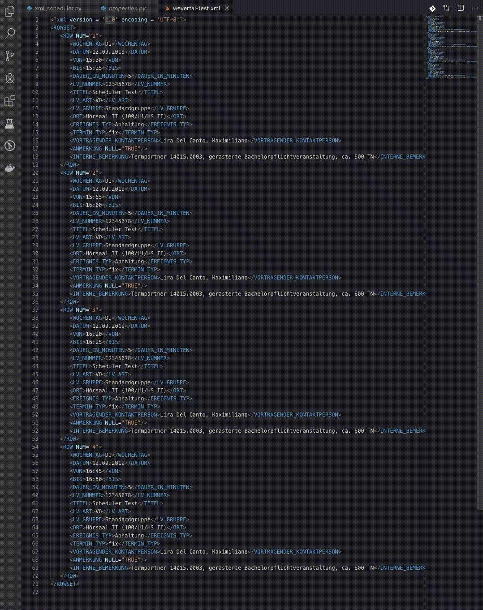

# OCscriptToolbox
A Django-based framework that contains a series of scripts as web applications

>At this moment it only contains one application, OC Scheduler, later with the development of this toolbox it will appear more web apps.

## Installation

Like any Django application is needed a Web Server Gateway Interface (WSGI) server to work. In my case I developed OCscriptToolboox using [mod_wsgi](http://www.modwsgi.org/).

### Prerequisites

OCscriptToolbox was designed under Python 3.6, to work is required that the WSGI server supports Python 3.

For installation of mod_wsgi in Centos 7, please look the appendix (write this).

### Configure Webserver (Apache)

> This instructions use the standard folders for apache in Centos 7, similar installation is for the other flavors of linux.

1. Clone this repository in `/var/www/`
1. move the file `config_files/apache/oc-toolbox.conf` to the folder `/etc/httpd/conf.d/` or add the contents to the end of the apache config file.

### Install and activate the virtual environment.

1. In the root folder of the app (Ex: `/var/www/OCscriptToolbox/`) create a new virtual environment called "env"
    
    `$ virualenv env --no-site-packages`

1. Activate the virtual environment.
    
    `$ source env/bin/activate`

1. Now that the Venv is activated, install the dependencies with PIP.

    `(env)$ pip install -r requirements.txt`

1. Deactivate the virtual environment.

    `(env)$ deactivate`

### Configure credentials and capture agent dictionary

In the file `OCscheduler/properties.py`, 
* Add the credentials. The credentials has to be with a user able to access to the external API of opencast.

* Set the Opencast server address

* Set the capture agent dictionary, this parameter is very important because allows to map the room code from the KLIPS system with the list of names registered in Opencast.

The names of each option are the same that are set on the user options in the Workflows.

### Configure webform

The webform is actually configured for a custom made options for the University of cologne. If you want to use with your own parameters, you need to modify the options names in:

* [forms.py](OCscheduler/scheduleForm/forms.py)
* [views.py](OCscheduler/scheduleForm/views.py)
* [xml_scheduler.py](OCscheduler/scheduleForm/xml_scheduler.py)

The 

### Restart apache

Restart apache using `$ sudo systemctl restart httpd`. After restart enter to 

